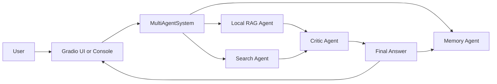
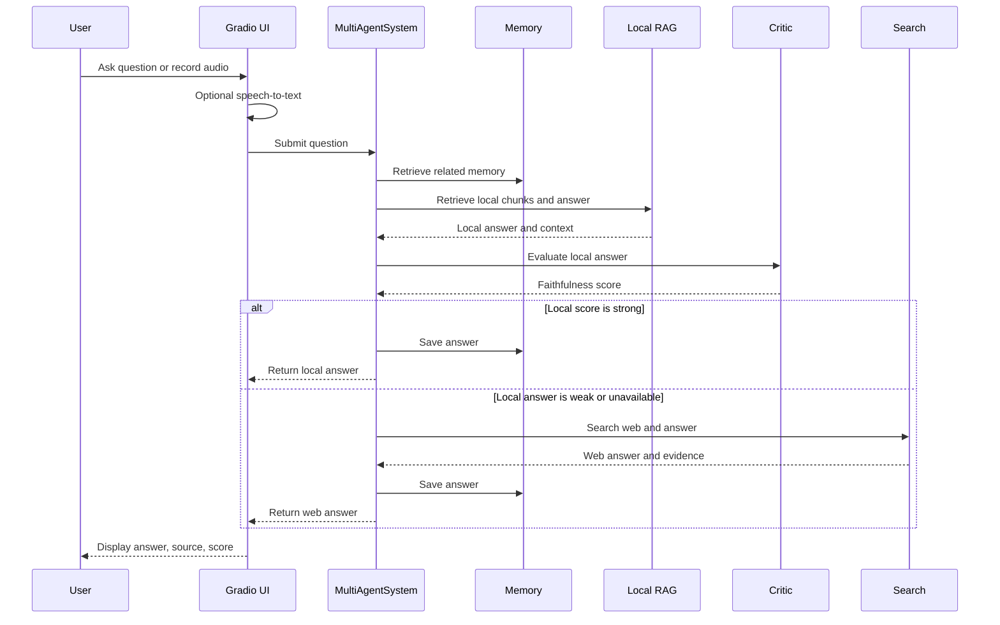
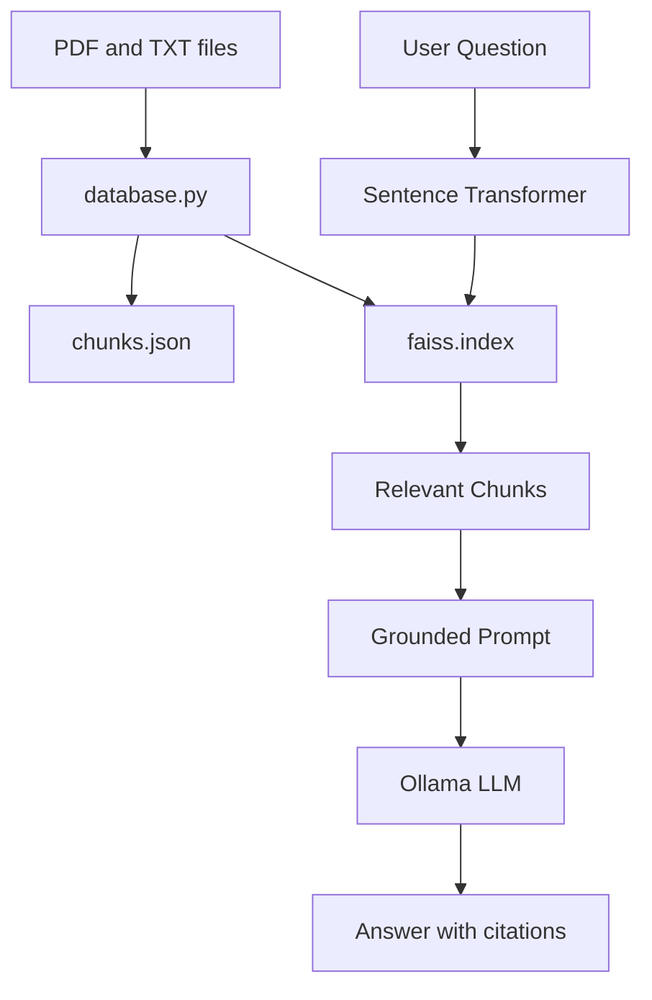

# Architecture

This project is a modular multi-agent research system. Each agent owns one responsibility, and the app layer coordinates them into a simple question-answering workflow.

## High-Level Design



The system favors local evidence first. If local retrieval produces a strong enough answer, it returns that answer. If not, it falls back to web search.

## Core Components

### Interface Layer

Files:

- `app/app/gradio_ui.py`
- `app/app/app.py`
- `app/app/ui.py`

Responsibilities:

- Provide a user-facing interface
- Accept text or microphone input
- Convert recorded audio to text
- Send the final question to the multi-agent runtime
- Display the answer, source, and score

`gradio_ui.py` is the recommended UI for normal use. It uses Gradio components for text, audio recording, transcription, and answer display.

### Runtime Orchestrator

File:

- `app/app.py`

Main class:

- `MultiAgentSystem`

Responsibilities:

- Receive a user question
- Retrieve memory context when available
- Run the local RAG pipeline first
- Evaluate local results with the critic when available
- Fall back to web search if local evidence is missing or weak
- Save successful answers to memory
- Return a structured result:

```python
{
    "question": "...",
    "answer": "...",
    "score": 0.92,
    "source": "local_rag"
}
```

The runtime is intentionally defensive. If optional dependencies are unavailable, it logs the issue and continues with the agents that are available.

### Local RAG Agent

Files:

- `RAG/RAG.py`
- `RAG/database.py`

Data:

- `RAG/documents/`
- `RAG/data/faiss.index`
- `RAG/data/chunks.json`

Responsibilities:

- Embed user questions with `BAAI/bge-small-en-v1.5`
- Search the FAISS index for relevant document chunks
- Build cited context blocks
- Generate a local answer with Ollama

The RAG agent only answers from retrieved local context. This keeps local answers grounded in the indexed documents.

### Search Agent

File:

- `search_agent/search_agent/search_agent.py`

Responsibilities:

- Search Tavily when configured
- Search DuckDuckGo as a lightweight fallback
- Merge and deduplicate web search results
- Build web evidence blocks
- Generate a web-grounded answer with Ollama

The search agent is useful for current information or questions not covered by the local document index.

### Critic Agent

File:

- `critical_agent/critical_agent/critical_agent.py`

Responsibilities:

- Evaluate whether an answer is faithful to the retrieved context
- Check for basic structural issues, such as missing citations
- Retry generation when faithfulness is too low
- Return a `Critique` object with:

```json
{
    "approved": true,
    "faithfulness_score": 0.91,
    "feedback": "OK",
    "warnings": []
}
```

The critic uses RAGAS faithfulness metrics through a LangChain Ollama wrapper.

### Memory Agent

File:

- `memory_agent/memory_agent.py`

Data:

- `memory_agent/memory/memory.json`
- `memory_agent/memory/memory.index`

Responsibilities:

- Save useful question-answer pairs
- Build a FAISS index over previous answers
- Retrieve relevant prior research for future questions
- Support final synthesis with remembered context

Memory helps the system improve across sessions by reusing prior final answers.

### Planner Agent

File:

- `planner_agent.py`

Responsibilities:

- Create multi-step execution plans
- Coordinate agent steps with dependencies
- Support a more advanced planning pipeline

This file contains a richer planner-oriented architecture. The current Gradio app uses `MultiAgentSystem` in `app/app/app.py`, while `planner_agent.py` can be used as a more advanced orchestration path.

## Request Lifecycle



## Data Flow



## Failure and Fallback Behavior

The application is built to continue running when some optional parts are missing:

- If the critic cannot import, local and web answers still work without a faithfulness score.
- If local RAG cannot load, the system can still try web search.
- If Tavily is unavailable, DuckDuckGo can still return evidence.
- If microphone transcription fails, users can still type questions manually.
- If no agent returns useful evidence, the system returns `No result found`.

## Extension Points

Good next places to improve the system:

- Add a source viewer in the Gradio UI
- Return full citation metadata instead of only `source` and `score`
- Add streaming answer generation
- Add local speech-to-text using Whisper or another offline model
- Add unit tests for each agent boundary
- Replace the simple fallback pipeline with the richer `PlannerAgent`
- Add Docker and GitHub Actions for reproducible setup

## Deployment Notes

For local development:

```powershell
python app/app/gradio_ui.py
```

For a public deployment, consider:

- Pinning Python and package versions
- Running Ollama or another model backend as a separate service
- Adding environment variables for search API keys
- Excluding generated FAISS indexes, memory files, and `__pycache__` from commits if they are not intended to be public
- Adding a proper license file before publishing
