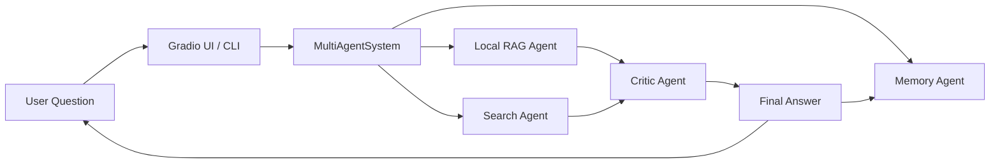

# Multi-Agent Autonomous Research System

A Python-based research assistant that coordinates multiple specialized agents to answer questions using local documents, web search, long-term memory, critique, and a simple Gradio voice interface.

The project is designed as a practical multi-agent RAG system: it first tries to ground answers in local indexed documents, falls back to web search when needed, evaluates faithfulness with a critic agent when available, and stores useful answers in memory for future queries.


## Highlights

- Local document question answering with FAISS and Sentence Transformers
- Web research through Tavily and DuckDuckGo search tools
- Critic agent for faithfulness checks using RAGAS and Ollama
- Persistent memory backed by JSON and a FAISS memory index
- Gradio UI with microphone recording and speech-to-text
- Graceful fallback behavior when optional services are unavailable
- LinkedIn-ready project visuals in `output/linkedin/`

## Demo UI

Run the Gradio interface:

```powershell
python app/app/gradio_ui.py
```

Open:

```text
http://127.0.0.1:7860
```

The UI lets you type a question or record microphone audio, transcribe it into text, and send it to the agent pipeline.


## Architecture Overview



For a deeper explanation, see [ARCHITECTURE.md](ARCHITECTURE.md).

## Agent Flow

1. The user asks a question through Gradio or the console app.
2. The memory agent retrieves relevant previous answers.
3. The local RAG agent searches indexed PDFs and text files.
4. If the local answer is unavailable or not strong enough, the search agent collects web evidence.
5. The critic agent checks whether generated answers are faithful to retrieved context.
6. The final answer is returned with a source and score, then saved to memory.


## Project Structure

```text
.
|-- app/
|       |-- app.py              # Main MultiAgentSystem runtime
|       |-- gradio_ui.py        # Gradio web UI with microphone support
|-- RAG/
|       |-- RAG.py              # Local RAG retrieval and generation
|       |-- database.py         # Builds the FAISS document index
|       |-- documents/          # Source PDFs and text files
|       `-- data/               # Generated FAISS index and chunks
|-- search_agent/
|       `-- search_agent.py     # Tavily and DuckDuckGo web search
|-- critical_agent/
|       `-- critical_agent.py   # Faithfulness evaluation loop
|-- memory_agent/
|       |-- memory_agent.py     # Long-term memory retrieval and storage
|       `-- memory/
|-- planner_agent.py            # Advanced planning orchestrator
|-- requirements.txt
`-- ARCHITECTURE.md
```

## Requirements

- Python 3.11 or newer is recommended
- Ollama installed and running locally
- An Ollama model such as `llama3`
- Optional: Tavily API key for Tavily web search
- Optional: internet access for Google speech recognition through `SpeechRecognition`

Install dependencies:

```powershell
pip install -r requirements.txt
```

Pull the default Ollama model:

```powershell
ollama pull llama3
```

## Environment Variables

Create a `.env` file if you want web search configuration:

```text
TAVILY_API_KEY=your_tavily_key_here
OLLAMA_MODEL=llama3
```

DuckDuckGo search can run without an API key. Tavily search is optional.

## Build the Local RAG Index

Place `.txt` or `.pdf` files in:

```text
RAG/RAG/documents/
```

Then build the FAISS index:

```powershell
python RAG/RAG/database.py
```

The generated index and chunk data are stored in:

```text
RAG/RAG/data/
```

## Run the Console App

```powershell
python app/app/app.py
```

Then type questions in the terminal.

## Run the Gradio App

```powershell
python app/app/gradio_ui.py
```

Open:

```text
http://127.0.0.1:7860
```

## Generate Social Images

This repository includes a script that generates project visuals for LinkedIn or GitHub:

```powershell
python scripts/generate_linkedin_images.py
```

Outputs are saved to:

```text
output/linkedin/
```


## Testing

Run:

```powershell
python -m unittest -v
```

At the moment, the repository has a minimal test scaffold. More complete tests should be added around retrieval, memory persistence, and pipeline fallback behavior.

## Notes

- If `ragas` or other critic dependencies are unavailable, the app still runs and falls back to direct RAG or web answers.
- If Tavily is not configured, DuckDuckGo search can still provide web evidence.
- Microphone transcription uses the `SpeechRecognition` package and Google recognition service by default.
- Local document quality depends on rebuilding the FAISS index after changing files in `RAG/RAG/documents/`.

## Roadmap Ideas

- Add richer automated tests for each agent
- Add streaming responses in Gradio
- Add better source citation display in the UI
- Support local/offline speech-to-text
- Add Docker setup for easier deployment
- Add evaluation scripts for retrieval and answer quality

## License

Add your preferred license before publishing publicly on GitHub.
